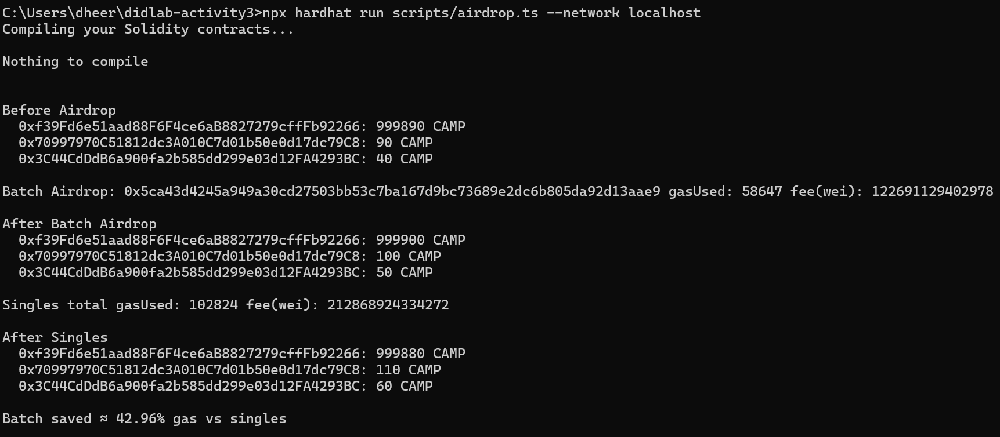

# CampusCredit Project Report

## Token Deployment Info
- **TOKEN_ADDRESS:** 0x5fbdb2315678afecb367f032d93f642f64180aa3 
- **Deploy Block:** 1n 
- **Roles:** DEFAULT_ADMIN_ROLE, MINTER_ROLE, CAP_ROLE (assigned to deployer)  
- **Cap:** 2,000,000 CAMP  

## Screenshots

- **Console Output deploy.ts**  
  

 - **Console Output transfer_approve.ts**  
   

- **Console Output from airdrop.ts**  
  
  

- **Console Output from logs_query.ts**  
  
    
  
  
  

- **MetaMask Custom Network + Token**  
  

## Airdrop Console Output
Example run:
```
Airdrop: 0xd95c6ac1406f9ebfbc07fa18ac7bd9711a05dbe6fd248bf55659690a407865e5 gasUsed: 76511 fee(wei): 168673160550120
Singles total gasUsed: 176448 fee(wei): 377241572594924
Batch saved ≈ 56.64% gas vs singles
```

## Why Airdrop is Gas-Aware
- Uses custom errors instead of strings (cheaper).  
- Packs calldata arrays tightly.  
- Uses unchecked loops to avoid overflow checks.  
- One transaction amortizes overhead across many transfers.  
